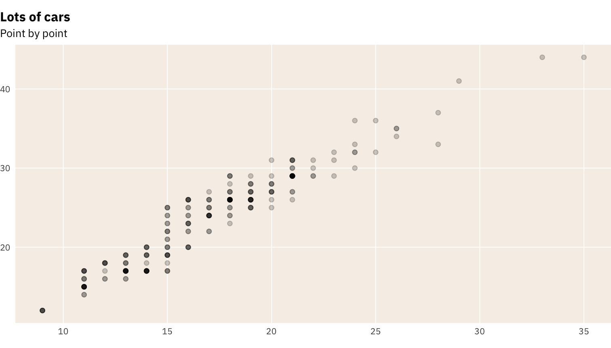
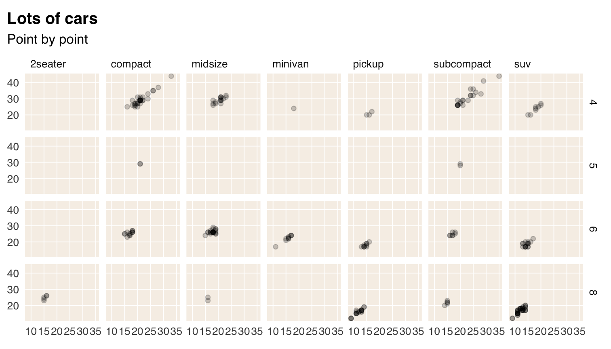

NB: This vignette temporarily serves to test and fine-tune the `theme_schola()` theme and to showcase typography.

This is a bit hacky so ignore font sizes and resolution, which can be handled better in normal Word or HTML output outside of package documentation.

When judging fonts, I would put quite a lot of emphasis on how they display figures, in particular whether the numerals have fixed width by default, meaning they align well: 99 is the same width as 11.

- Roboto Condensed, IBM Plex Sans, Titillium Sans and Econ Sans all do.
- Roboto Condensed is nice in that it has a normal-width sibling, Roboto, which also has fixed-width figures. It is good to have the normal and condensed fonts when needed, e.g. the condensed works well for crowded axes or longer titles.
- Arial Narrow is fine - you can then use Arial in you word output or generic sans in web output and they would be visually consistent with the charts. But it is not open license so we cannot include it in the package; anyone using the package would have to make sure they have it on their computer.
- Open Sans, which your website uses, is fine and has good figures, but seems a bit too wide for charts.

(If we are producing PNG figures, we don't need to worry about which fonts the user of the report has installed on their computer).


## The Schola ggplot2 theme

First, let's see the default plot, no theme


```r
p <- ggplot(mpg) +
 geom_bar(aes(y = class)) +
 labs(title = "Lots of cars", subtitle = "Count of numbers")
p
```


using `theme_schola()` defaults


```r
p +
 theme_schola("x")
```


in combination with `flush_axis`, and using the Titillium Web font:


```r
p +
 theme_schola("x", family = "Titillium Web") +
 scale_x_continuous(expand = flush_axis)
```


Scatterplot, using yet another font


```r
ggplot(mpg) +
 geom_point(aes(cty, hwy)) +
 theme_schola("scatter", family = "IBM Plex Sans") +
 labs(title = "Lots of cars", subtitle = "Point by point")
```


Smaller text, flush plot alignment


```r
ggplot(mpg) +
 geom_point(aes(cty, hwy), alpha = .2) +
 theme_schola("scatter", base_size = 9, side_margin = 0, family = "IBM Plex Sans") +
 labs(title = "Lots of cars", subtitle = "Point by point")
```



### Override defaults changed inside `theme_schola()`


```r
ggplot(mpg) +
 geom_point(aes(cty, hwy), alpha = .2) +
 theme_schola("scatter", base_size = 12, side_margin = 0, family = "Roboto Condensed") +
 labs(title = "Lots of cars", subtitle = "Point by point") +
 theme(panel.background = element_rect(fill = "lightpink"))
```


### Small mutliples

Smaller text, using Arial Narrow


```r
p +
 theme_schola("x", multiplot = T, family = "Arial Narrow") +
 scale_x_continuous(expand = flush_axis) +
 facet_wrap(~ manufacturer, nrow = 2)
```


Same without aesthetic adjustment for `facet_wrap()` and different font


```r
p +
 theme_schola("x", multiplot = F, family = "Public Sans") +
 scale_x_continuous(expand = flush_axis) +
 facet_wrap(~ manufacturer, nrow = 2)
```


Small mutliples scatter and make it look like The Economist


```r
ggplot(mpg) +
 geom_point(aes(cty, hwy), alpha = .2) +
 theme_schola("scatter", multiplot = T, family = hrbrthemes::font_es,
              title_family = hrbrthemes::font_es_bold) +
 labs(title = "Lots of cars", subtitle = "Point by point") +
 facet_wrap(~ class, nrow = 2)
```


Small mutliples grid, using another font setup


```r
p +
 theme_schola("x", multiplot = T, family = "IBM Plex Sans Light",
              title_family = "IBM Plex Sans Bold") +
 scale_x_continuous(expand = flush_axis) +
 facet_grid(cyl ~ drv)
```


Small mutliples scatter grid, using mix of Roboto fonts


```r
ggplot(mpg) +
 geom_point(aes(cty, hwy), alpha = .2) +
 theme_schola("scatter", multiplot = T, family = "Roboto Condensed",
              title_family = "Roboto") +
 labs(title = "Lots of cars", subtitle = "Point by point") +
 facet_grid(cyl ~ class)
```


Same but without multiplot parameter


```r
ggplot(mpg) +
 geom_point(aes(cty, hwy), alpha = .2) +
 theme_schola("scatter", multiplot = F) +
 labs(title = "Lots of cars", subtitle = "Point by point") +
 facet_grid(cyl ~ class)
```



