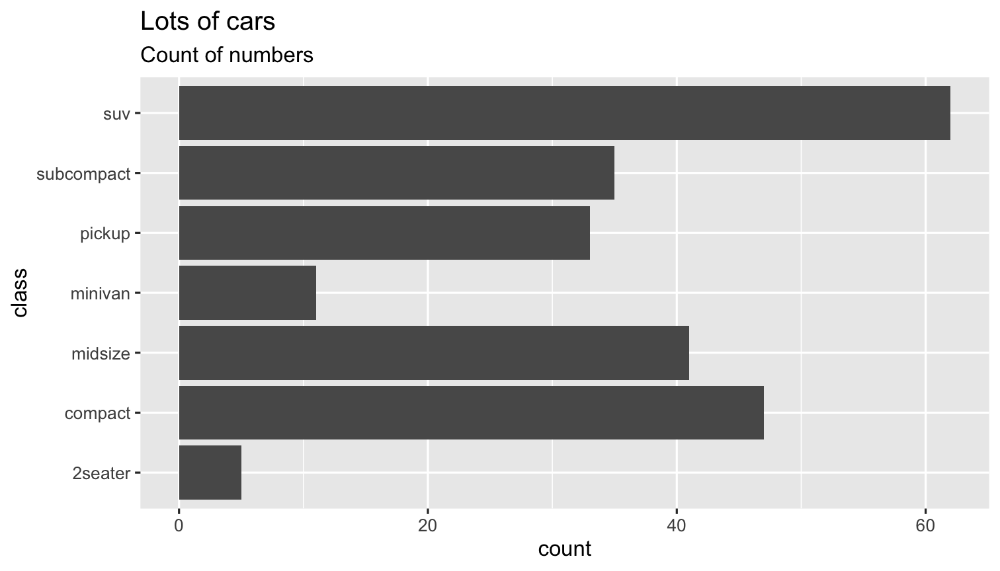
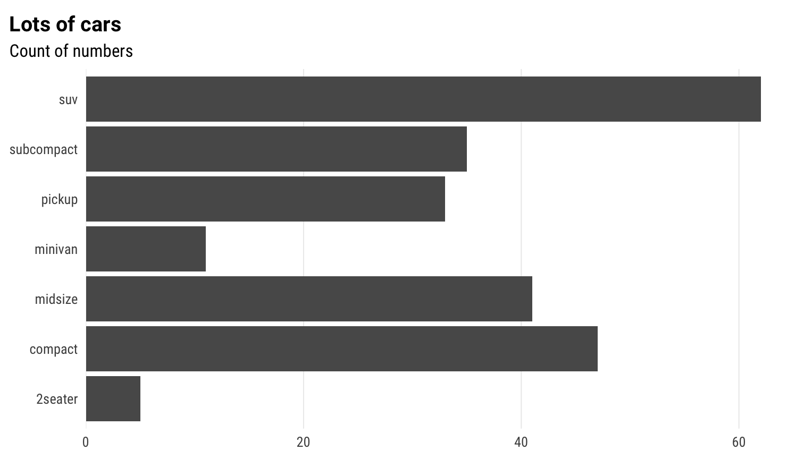
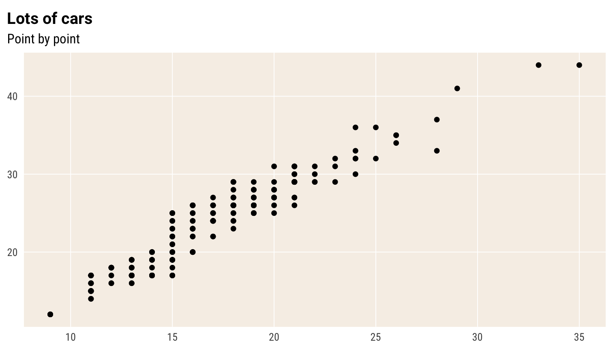
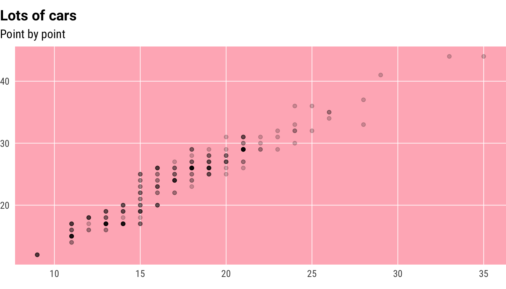
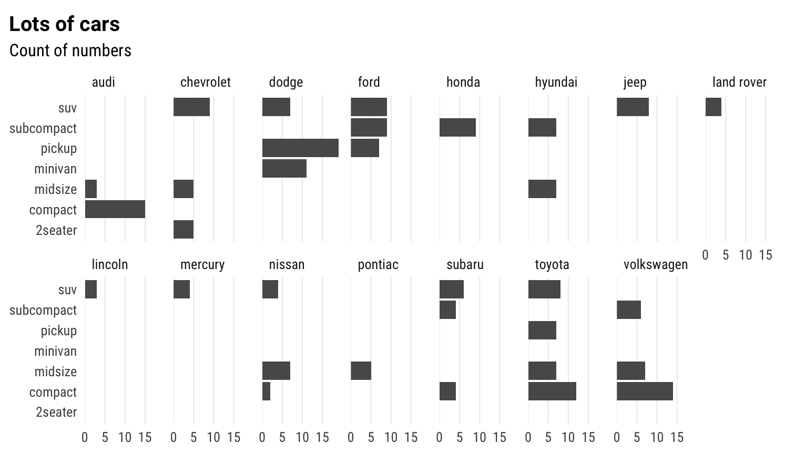
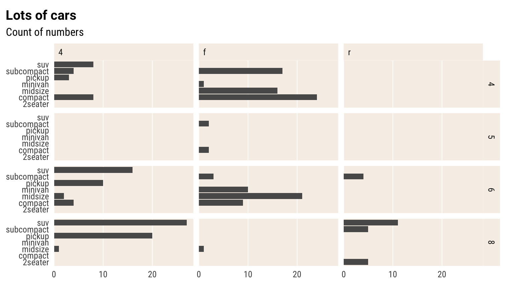

<!-- Once done editing, rename this to charts.Rmd.orig -->

<!-- If you are editing charts.Rmd, stop and go to charts.Rmd.orig -->

## `reschola` and charts

This document assumes two things:

- charts are made in ggplot2
- you have a fair understanding of ggplot2, so this is not a guide to using that package.

It also does not reiterate the principles of data visualisation, though it does point to some resources in that vein.

## The reschola theme

##### Global theme setting {.bs-callout .bs-callout-blue}

You can set the theme for your whole Rmarkdown document (or session, for that matter) by putting `theme_set(theme_schola())`. Then you don't need to add it to your plots. As `theme_schola()` has parameters which you are likely to need, this seems impractical and anyway could be confusing.

### Basic usage of `theme_schola()`

`reschola` contains the `theme_schola()` theme, which has

- sensible defaults so you are not forever changing the same parameters
- some aesthetic choices custom for Schola Emppirica
- good default fonts

The examples below serve as (a) guide to the parameters of the theme, (b) test, and (c) showcase.

> Resolution and sizes can be off on this page. The templates contained in this package are optimised to produce great looking and properly sized charts in Word documents.

First, let's see the default plot, no theme


```r
p <- ggplot(mpg) +
 geom_bar(aes(y = class)) +
 labs(title = "Lots of cars", subtitle = "Count of numbers")
p
```



Now let's see what `theme_schola()` defaults do


```r
p +
 theme_schola("x") # only setting the first parameter to get the right gridlines
```


in combination with `flush_axis`


```r
p +
 theme_schola("x") +
 scale_x_continuous(expand = flush_axis)
```



Scatterplot


```r
ggplot(mpg) +
 geom_point(aes(cty, hwy)) +
 theme_schola("scatter") +
 labs(title = "Lots of cars", subtitle = "Point by point")
```



Smaller text, flush plot alignment


```r
ggplot(mpg) +
 geom_point(aes(cty, hwy), alpha = .2) +
 theme_schola("scatter", base_size = 9, margin_side = 0) +
 labs(title = "Lots of cars", subtitle = "Point by point")
```


If you are adding a caption in your Rmarkdown chunk, you may also want `margin_bottom = 0` to cut the bottom margin in the plot and move the caption closer to the plot.

#### Override defaults changed inside `theme_schola()`


```r
ggplot(mpg) +
 geom_point(aes(cty, hwy), alpha = .2) +
 theme_schola("scatter", base_size = 12, margin_side = 0) +
 labs(title = "Lots of cars", subtitle = "Point by point") +
 theme(panel.background = element_rect(fill = "lightpink"))
```



#### Small mutliples


```r
p +
 theme_schola("x", multiplot = T) +
 scale_x_continuous(expand = flush_axis) +
 facet_wrap(~ manufacturer, nrow = 2)
```


Same without aesthetic adjustment for `facet_wrap()`


```r
p +
 theme_schola("x", multiplot = F) +
 scale_x_continuous(expand = flush_axis) +
 facet_wrap(~ manufacturer, nrow = 2)
```



Small mutliples scatter


```r
ggplot(mpg) +
 geom_point(aes(cty, hwy), alpha = .2) +
 theme_schola("scatter", multiplot = T) +
 labs(title = "Lots of cars", subtitle = "Point by point") +
 facet_wrap(~ class, nrow = 2)
```


Small mutliples grid


```r
p +
 theme_schola("x", multiplot = T) +
 scale_x_continuous(expand = flush_axis) +
 facet_grid(cyl ~ drv)
```



Small mutliples scatter grid


```r
ggplot(mpg) +
 geom_point(aes(cty, hwy), alpha = .2) +
 theme_schola("scatter", multiplot = T) +
 labs(title = "Lots of cars", subtitle = "Point by point") +
 facet_grid(cyl ~ class)
```


Same but without multiplot parameter


```r
ggplot(mpg) +
 geom_point(aes(cty, hwy), alpha = .2) +
 theme_schola("scatter", multiplot = F) +
 labs(title = "Lots of cars", subtitle = "Point by point") +
 facet_grid(cyl ~ class)
```


## Building a diverging Likert plot

[To be completed once the function is in place]

## Using colour scales

[To be completed once the scales are in place]

## Using custom numeric scales

[To be completed once the scales are in place]

## Making fonts work

The `schola_theme()` is set to use the Roboto and Roboto Condensed font families by default.
These may not be present on your system.
You can install them by running `reschola::import_fonts()`. (once per machine, and do follow the instructions in the message output when you call this function.)
On package load, these will be registered with R.
If the fonts do not show up in your charts, run `extrafont::loadfonts()` (once per session).
You can also set the option `reschola.loadfonts` to have `reschola` register these fonts with the PDF/PostScript ecosystem upon package load.

## Using fonts

If you end up using different fonts, it is good to choose something that (a) has fixed-width figures in the default set of characters, and (b) has sensible widths or a narrow-width member of the type family (usually called "Condensed", "Narrow" or some such.)

The `hrbrthemes` package has a good range of fonts, some of which tick these criteria. Arial Narrow is narrow and has fixed-width figures.
IBM Plex Sans, Titillium Sans and Econ Sans all have fixed width figures but not all have Narrow companions.

Public Sans does not have fixed-width figures.

See the [hrbrthemes vignette](https://cran.r-project.org/web/packages/hrbrthemes/vignettes/why_hrbrthemes.html#kern-what) for an explanation of why these criteria matter

## Tricks of the trade for ggplot2

- `theme_void()` for visuals that don't need any gridlines, axes, etc., such as schematic maps
- aes(..., group = 1) for making all data points in a `geom_line()` into one line
- `key_glyph` parameter to geoms to pick a specific shape for the legend key
- `geom_sf_label` for intelligently labelling spatial features plotted through `geom_sf()`
- `labs(colour = NULL)` for switching off the colour legend, `labs(x = NULL)` to turn off colour label -  quicker than `theme(axis.label.x = element_blank())` and `guides(colour = "none")`

## Resources on good practice

Kieran Healy. [Data Visualisation: a practical introduction](http://socviz.co). With R code.

Claus Wilke.    [Fundamentals of Data Visualisation](https://serialmentor.com/dataviz/) No R code, very strong on principles.

Beyond that and in the world of paper books, anything by Alberto Cairo is solid.

## Handy (or just cool) ggplot2 extensions

### Crucial

- `patchwork` for combining multiple plots into one in a simple, intuitive way, while merging legends and aligning everyhing as needed
- `ggraph` in combination with `tidygraph` for network data
- `ggcorr` for correlation matrices
- `GGally` with a set of utilities, incl. `GGally::ggpairs()`
- `sjPlot` also provides useful visual forms, most usefully the visual and tabular summaries of model results

### Useful

- `ggtext` for formatting pretty much any text in a ggplot using Markdown/HTML
- `ggiraph` for basic web interactivity
- `ggforce` for cool annotation
- `ggrepel` for handling overlapping labels
- `gghighlight` for highlighting individual points/series
- `ggmosaic` for mosaic plots
- `ggalluvial` for Sankey diagrams
- `waffle` for waffle (square pie) charts incl Isotype-style charts using icons

### Fun

- `ggchiclet` for rounded bars
